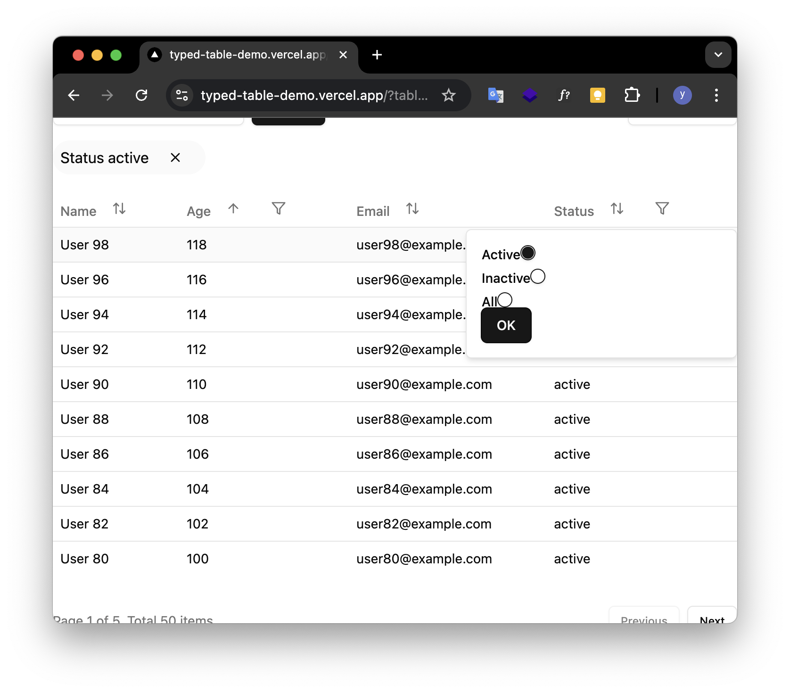
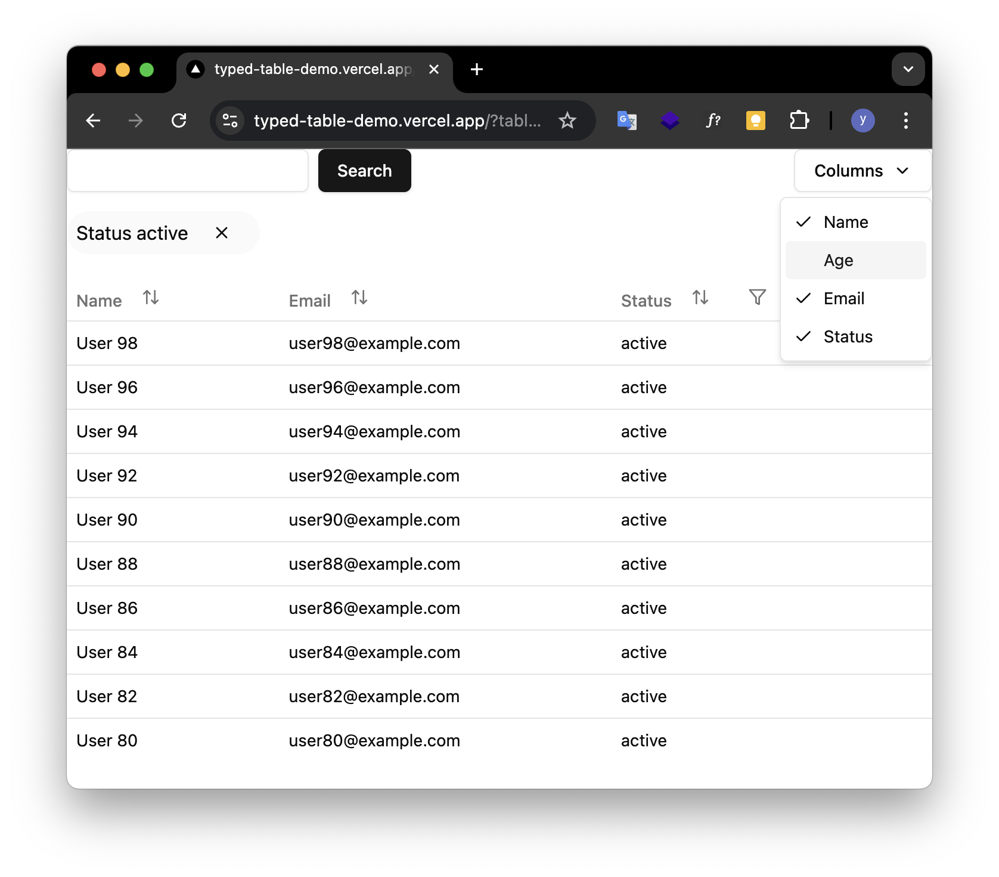

# タイプレベルリファクタリング奮闘記
## 〜この「型パズル」は読めません！〜

<div style="text-align:right">
ygkn / Yugo Yagita<br>
@ygkn35034
</div>

---

# 自己紹介


- Yugo Yagita (ygkn)
- 株式会社ゆめみ フロントエンドエンジニア
- TypeScriptとReactを書いています
- アクセシビリティに興味があります

---

# テーブルをリファクタリングした話

デモ： https://typed-table-demo.vercel.app/
（このデモは型が主役のため、実装はやっつけになっています）

---


---


---




---



---

# ストーリー

1. 型安全でないテーブル設定の問題
2. 「型パズル」への挑戦、没頭
3. 300行を超える型定義地獄
4. リファクタリングへの挑戦

---

# 最初のコード

テーブルコンポーネントの設定が複数の場所に分散していた

```typescript
// tableConfigs.ts
const tableConfigs: TableConfigs<User> = {
  name: { name: '名前' },
  age: { name: '年齢' }
};
```

```typescript
// filterConfigs.ts（別ファイル）
const filterConfigs: TableFilterConfigs<User> = {
  name: null,
  age: null
};
```

---

# 何が問題だったのか？

- 設定が複数ファイルに分散している
- カラム間の整合性が型で保証されない
- フィルター設定の不整合が検出できない

---

# さらなる問題

フィルターの型もすべて `string` になってしまう

イメージ：

```typescript
const { data } = useUserData({
  name: filterState.name,
  age: Number(filterState.age),
  status: filterState.status as "active" | "inactive",
})
```

---

# 型安全なテーブルを作りたい


---

```typescript
const { table, columnFilter } = createTable<UserViewModel>();

const usersTable = table({
  key: "users",
  pagination: { perPage: 10 },
  keywordSearch: { /* キーワード検索の設定 */},
  columns: [
    {
      key: "name",
      filter: null,
      sortable: true,
      visibility: { initialVisibility: true },
      renderHeadCell: () => "名前",
      renderBodyCell: ({ row }) => row.name
    },
    {
      key: "age",
      filter: columnFilter<AgeFilter>({
        renderPopupContent: ({ filter, setFilter }) => (/* ... */),
        // ...フィルター設定
      }),
      // ...他の設定
    }
  ]
});

```

---

# 型安全になった！

```ts

actions.setFilter("age", { min: 20, max: null }); // OK
actions.setFilter("status", "active"); // OK

// 型エラーが検出される！
actions.setFilter("nonExistent", { min: 20 }); // NG
actions.setFilter("status", true); // NG
```

---

# しかし…


---

例：フィルター可能なカラムのキーだけを抽出する型

```typescript
type FilterableKeys<T extends TableColumnDefinition<any, any>[]> = {
  [K in keyof T]: T[K] extends TableColumnDefinition<infer Key, any>
    ? T[K]["filter"] extends null
      ? never
      : Key
    : never;
}[number];
```

---


例：フィルターの状態の型を推論する


```typescript
type InferFilterState<T extends TableColumnDefinition<any, any>[]> = {
  [K in FilterableKeys<T>]: Extract<
    T[number],
    TableColumnDefinition<K, any>
  >["filter"] extends TableColumnFilterWithSchema<infer Schema>
    ? v.InferOutput<Schema> | null
    : // さらに条件分岐...
}
```


---

```typescript
type NonEmptyArray<T> = [T, ...T[]];

/**
 * テーブルに表示するデータ
 *
 * APIから取得したデータは、この型に変換してテーブルに表示する
 */
export type AnyTableViewModelBase = Record<string, unknown>;

/**
 * ページネーションの設定
 *
 * null の場合はページネーションを表示しない（指定忘れ防止のため、optional ではない）
 */
export type TablePaginationDefinition = null | {
  /**
   * 1ページあたりの表示数
   */
  parPage: number;
};

/**
 * キーワード検索の設定
 *
 * null の場合はキーワード検索を表示しない（指定忘れ防止のため、optional ではない）
 */
export type TableKeywordSearchDefinition = null | {
  renderSearchInput: (props: {
    value: string;
    onChange: (value: string) => void;
  }) => ReactNode;

  encode: (value: string) => string;
  decode: (value: string) => string | null;
};

export type NonNullColumnFilterDefinition<
  TableViewModelBaseType extends AnyTableViewModelBase,
  // eslint-disable-next-line @typescript-eslint/no-explicit-any
  FilterCondition = any
> = {
  renderPopupContent: (props: {
    rows: TableViewModelBaseType[];
    filter: FilterCondition | null;
    setFilter: (filter: FilterCondition | null) => void;
    isOpen: boolean;
    onClose: () => void;
  }) => ReactNode;
  renderFilterChipContent: (props: { filter: FilterCondition }) => ReactNode;
  encode: (filter: FilterCondition | null) => unknown;
  decode: (filter: unknown) => FilterCondition | null;
  initial: FilterCondition | null;
};

/**
 * 列のフィルターの設定
 *
 * null の場合はフィルターを表示しない（指定忘れ防止のため、optional ではない）
 */
export type ColumnFilterDefinition<
  TableViewModelBaseType extends AnyTableViewModelBase,
  // eslint-disable-next-line @typescript-eslint/no-explicit-any
  FilterCondition = any
> = null | NonNullColumnFilterDefinition<
  TableViewModelBaseType,
  FilterCondition
>;

/**
 * 列の表示/非表示の設定
 */
export type ColumnVisibilityDefinition = {
  initialVisibility: boolean;
};

/**
 * 列の定義
 */
export type ColumnDefinition<
  TableViewModelType extends AnyTableViewModelBase,
  K extends keyof TableViewModelType = keyof TableViewModelType,
  TColumnFilterDefinition extends ColumnFilterDefinition<TableViewModelType> = ColumnFilterDefinition<TableViewModelType>,
  TColumnSortDefinition extends boolean = boolean
> = {
  key: K;

  filter: TColumnFilterDefinition;

  sortable: TColumnSortDefinition;

  visibility: ColumnVisibilityDefinition;

  renderHeadCell: () => string;

  renderBodyCell: (props: {
    rowIndex: number;
    row: TableViewModelType;
    data: TableViewModelType[];
  }) => ReactNode;
};

export type TableDefinition<
  TableViewModelBaseType extends AnyTableViewModelBase,
  TablePaginationDefinitionType extends TablePaginationDefinition = TablePaginationDefinition,
  TableKeywordSearchDefinitionType extends TableKeywordSearchDefinition = TableKeywordSearchDefinition,
  ColumnDefinitions extends Array<
    ColumnDefinition<TableViewModelBaseType>
  > = Array<ColumnDefinition<TableViewModelBaseType>>
> = {
  /**
   * テーブルのキー
   *
   * localStorage に保存する際のキーとして使用する
   */
  key: string;

  pagination: TablePaginationDefinitionType;

  keywordSearch: TableKeywordSearchDefinitionType;

  columns: ColumnDefinitions;
};

/**
 * テーブルのキーワード検索の状態
 */
export type TableKeywordSearchState<
  TableViewModelBaseType extends AnyTableViewModelBase,
  TableDefinitionType extends TableDefinition<TableViewModelBaseType>
> =
  // TableDefinition から TableKeywordSearchDefinition を取り出す
  TableDefinitionType extends TableDefinition<
    TableViewModelBaseType,
    TablePaginationDefinition,
    infer TableKeywordSearchDefinitionInfer extends TableKeywordSearchDefinition
  >
    ? TableKeywordSearchDefinitionInfer extends null
      ? undefined
      : string
    : never;

type AnyTableSortState<
  SortBy extends string = string,
  SortOrder extends "asc" | "desc" = "asc" | "desc"
> = {
  sortBy: SortBy;
  sortOrder: SortOrder;
};

/**
 * テーブルのソートの状態
 *
 * デフォルトのソート順のときは undefined とする
 */
export type TableSortState<
  TableViewModelBaseType extends AnyTableViewModelBase,
  TableDefinitionType extends TableDefinition<TableViewModelBaseType>
> =
  // TableDefinition から ColumnDefinitions を取り出す
  TableDefinitionType extends TableDefinition<
    TableViewModelBaseType,
    TablePaginationDefinition,
    TableKeywordSearchDefinition,
    infer ColumnDefinitionsInfer
  >
    ? ColumnsSortKey<
        TableViewModelBaseType,
        ColumnDefinitionsInfer
      > extends string
      ?
          | AnyTableSortState<
              ColumnsSortKey<TableViewModelBaseType, ColumnDefinitionsInfer>
            >
          | undefined
      : undefined
    : never;

type TableSortKey<
  TableViewModelBaseType extends AnyTableViewModelBase,
  TableDefinitionType extends TableDefinition<TableViewModelBaseType>
> = TableDefinitionType extends TableDefinition<
  TableViewModelBaseType,
  TablePaginationDefinition,
  TableKeywordSearchDefinition,
  infer ColumnDefinitions
>
  ? ColumnsSortKey<TableViewModelBaseType, ColumnDefinitions>
  : never;

type ColumnsSortKey<
  TableViewModelBaseType extends AnyTableViewModelBase,
  ColumnDefinitions extends Array<ColumnDefinition<TableViewModelBaseType>>
> =
  // ColumnDefinitions に対して、再帰的に ColumnSortState を適用する
  // イメージ：
  // ColumnsSortState<..., [ColumnDefinition<...>, ColumnDefinition<...>]> =
  //   ColumnSortState<...> | ColumnsSortState<..., [ColumnDefinition<...>]> =
  //   ColumnSortState<...> | ColumnSortState<...> | ColumnsSortState<..., []> =
  //   ColumnSortState<...> | ColumnSortState<...> | never (union の単位元) =
  //   ColumnSortState<...> | ColumnSortState<...>
  //
  // ColumnDefinitions がタプルでない配列ならば、never を返す
  number extends ColumnDefinitions["length"]
    ? never
    : ColumnDefinitions extends [
        // 先頭の ColumnDefinition を取り出す
        ColumnDefinition<
          TableViewModelBaseType,
          infer Key,
          ColumnFilterDefinition<TableViewModelBaseType>,
          infer ColumnSortDefinitionType
        >,
        // 残りの ColumnDefinition の配列を取り出す。
        ...infer RestColumnDefinitions
      ]
    ?
        | ColumnSortState<TableViewModelBaseType, Key, ColumnSortDefinitionType>
        // 残りの ColumnDefinitions が空でないならば（停止条件）
        | (RestColumnDefinitions extends NonEmptyArray<
            ColumnDefinition<TableViewModelBaseType>
          >
            ? // 再帰的に ColumnsSortState を適用する
              ColumnsSortKey<TableViewModelBaseType, RestColumnDefinitions>
            : never)
    : never;

type ColumnSortState<
  TableViewModelBaseType extends AnyTableViewModelBase,
  Key extends keyof TableViewModelBaseType = keyof TableViewModelBaseType,
  ColumnSortableDefinitionType extends boolean = boolean
> = ColumnSortableDefinitionType extends true ? Key : never;

type TableColumnVisibilityState<
  TableViewModelBaseType extends AnyTableViewModelBase
> = Array<keyof TableViewModelBaseType>;

type TablePaginationState<
  TableViewModelBaseType extends AnyTableViewModelBase,
  TableDefinitionType extends TableDefinition<TableViewModelBaseType>
> =
  // TableDefinition から TablePaginationDefinition を取り出す
  TableDefinitionType extends TableDefinition<
    TableViewModelBaseType,
    infer TablePaginationDefinitionInfer
  >
    ? TablePaginationDefinitionInfer extends null
      ? undefined
      : number
    : never;

type TableFilterColumnState<
  TableViewModelBaseType extends AnyTableViewModelBase,
  TableDefinitionType extends TableDefinition<TableViewModelBaseType>
> =
  // TableDefinition から ColumnDefinitions を取り出す
  TableDefinitionType extends TableDefinition<
    TableViewModelBaseType,
    TablePaginationDefinition,
    TableKeywordSearchDefinition,
    infer ColumnDefinitions
  >
    ? ColumnsFilterState<TableViewModelBaseType, ColumnDefinitions>
    : never;

type ColumnsFilterState<
  TableViewModelBaseType extends AnyTableViewModelBase,
  ColumnDefinitions extends Array<ColumnDefinition<TableViewModelBaseType>>
> =
  // ColumnDefinitions から ColumnFilterState を組み立てる
  //
  // イメージ：
  // ColumnsFilterState<..., [ColumnDefinition<...>, ColumnDefinition<...>]> =
  //   ColumnFilterState<...> & ColumnsFilterState<..., [ColumnDefinition<...>]> =
  //   ColumnFilterState<...> & ColumnFilterState<...> & ColumnsFilterState<..., []> =
  //   ColumnFilterState<...> & ColumnFilterState<...> & {} (intersection の単位元) =
  //   ColumnFilterState<...> & ColumnFilterState<...>
  //
  // ColumnDefinitions がタプルでない配列ならば、never を返す
  number extends ColumnDefinitions["length"]
    ? never
    : // ColumnDefinitions から ColumnFilterState を組み立てる
    ColumnDefinitions extends [
        ColumnDefinition<
          TableViewModelBaseType,
          infer Key,
          infer ColumnFilterDefinitionType
        >,
        ...infer RestColumnDefinitions
      ]
    ? ColumnFilterState<
        TableViewModelBaseType,
        Key,
        ColumnFilterDefinitionType
      > & //
        // 残りの ColumnDefinitions が空（停止条件）でないならば
        (RestColumnDefinitions extends NonEmptyArray<
          ColumnDefinition<TableViewModelBaseType>
        >
          ? ColumnsFilterState<TableViewModelBaseType, RestColumnDefinitions>
          : Record<never, never>)
    : never;

type ColumnFilterState<
  TableViewModelBaseType extends AnyTableViewModelBase,
  Key extends keyof TableViewModelBaseType,
  ColumnFilterDefinitionType extends ColumnFilterDefinition<TableViewModelBaseType>
> = ColumnFilterDefinitionType extends null
  ? Record<never, never>
  : ColumnFilterDefinitionType extends ColumnFilterDefinition<
      TableViewModelBaseType,
      infer FilterConditionInfer
    >
  ? {
      [key in Key]: FilterConditionInfer | null;
    }
  : never;

type TableColumnFilterCondition<
  TableViewModelBaseType extends AnyTableViewModelBase,
  TableDefinitionType extends TableDefinition<TableViewModelBaseType>,
  ColumnKey extends keyof TableViewModelBaseType
> =
  // TableDefinition から ColumnDefinitions を取り出す
  TableDefinitionType extends TableDefinition<
    TableViewModelBaseType,
    TablePaginationDefinition,
    TableKeywordSearchDefinition,
    infer ColumnDefinitions
  >
    ? ColumnDefinitions[number] &
        ColumnDefinition<
          TableViewModelBaseType,
          ColumnKey
        > extends ColumnDefinition<
        TableViewModelBaseType,
        ColumnKey,
        ColumnFilterDefinition<
          TableViewModelBaseType,
          infer FilterConditionInfer
        >
      >
      ? FilterConditionInfer
      : never
    : never;

export type TableState<
  TableViewModelBaseType extends AnyTableViewModelBase,
  TableDefinitionType extends TableDefinition<TableViewModelBaseType>
> = {
  keywordSearch: TableKeywordSearchState<
    TableViewModelBaseType,
    TableDefinitionType
  >;
  sort: TableSortState<TableViewModelBaseType, TableDefinitionType>;
  columnVisibility: TableColumnVisibilityState<TableViewModelBaseType>;
  pagination: TablePaginationState<TableViewModelBaseType, TableDefinitionType>;

  filter: TableFilterColumnState<TableViewModelBaseType, TableDefinitionType>;
};

```

---

# 型だけで300行も…


---


# チームメンバー「この型は読めないですね...」

# 自分「確かに…」

---

# リファクタリングへの挑戦

型を読めてメンテナンスできるようにしよう！

※ 厳密には「リファクタリング」ではなく、インターフェースを変更する必要がありました

---

# リファクタリングの方針

1. 型のテストを書いて安全に修正できるようにする
2. 必要以上の型安全性を追求せず保守性を優先
3. コンポーネントのコンポジションで解決できる部分は型推論に頼らない
4. AIを使った型リファクタリング

---

# 型のテストの導入

```typescript
test("テーブルのstateが定義から推論されること", () => {
  expectTypeOf(table.useTable).returns.toHaveProperty("state")
    .toEqualTypeOf<{
      keywordSearch: string | null;
      // ...期待する型
    }>();
});
```

https://vitest.dev/guide/testing-types

安心して編集できる！

---

# 型推論に全て頼らず、Reactのコンポジションを活用

Before:

```tsx
const table = createTable<User>({
  // ...
  pagination: null // テーブルで使用しない場合はnull
});

useTable().state.pagination // null になる
```

After:
```tsx
<Table>
  {/* <Pagination ... /> */}
</Table>
```

型推論がシンプルに！

---

# 必要以上の型安全性は追求しない

---

Before

```typescript
type TablePaginationState<
  TableViewModelBaseType extends AnyTableViewModelBase,
  TableDefinitionType extends TableDefinition<TableViewModelBaseType>
> =
  // TableDefinition から TablePaginationDefinition を取り出す
  TableDefinitionType extends TableDefinition<
    TableViewModelBaseType,
    infer TablePaginationDefinitionInfer
  >
    ? TablePaginationDefinitionInfer extends null
      ? undefined
      : number
    : never;
```

---

After

```ts
// After: 常に存在する単純な型に
type TableState = {
  pagination: number;  // 常に存在、必要なければ使わない
  keywordSearch: string | null;  // 同様
  // ...
};
```

---

# 必要以上の型安全性は追求しない

プロダクトの安定性に寄与しない必要以上の「型安全性」は追求しない

- 「無い機能のstateが初期状態として出てしまう」程度の問題は許容
- 過度な抽象化によるデメリットを考慮
- コードのメンテナンスしやすさを優先


---

# AIの力を借りる

---

 Before

```typescript
type ColumnsSortKey<
  TableViewModelBaseType extends TableViewModelBase,
  ColumnDefinitions extends Array<ColumnDefinition<TableViewModelBaseType>>,
> =
  // ColumnDefinitions に対して、再帰的に ColumnSortState を適用する
  // イメージ：
  // ColumnsSortState<..., [ColumnDefinition<...>, ColumnDefinition<...>]> =
  //   ColumnSortState<...> | ColumnsSortState<..., [ColumnDefinition<...>]> =
  //   ColumnSortState<...> | ColumnSortState<...> | ColumnsSortState<..., []> =
  //   ColumnSortState<...> | ColumnSortState<...> | never (union の単位元) =
  //   ColumnSortState<...> | ColumnSortState<...>
  //
  // ColumnDefinitions がタプルでない配列ならば、never を返す
  number extends ColumnDefinitions['length']
    ? never
    : ColumnDefinitions extends [
          // 先頭の ColumnDefinition を取り出す
          ColumnDefinition<
            TableViewModelBaseType,
            infer Key,
            ColumnFilterDefinition<TableViewModelBaseType>,
            infer ColumnSortDefinitionType
          >,
          // 残りの ColumnDefinition の配列を取り出す。
          ...infer RestColumnDefinitions,
        ]
      ?
          | (ColumnSortDefinitionType extends true ? Key : never)
          // 残りの ColumnDefinitions が空でないならば（停止条件）
          | (RestColumnDefinitions extends NonEmptyArray<
              ColumnDefinition<TableViewModelBaseType>
            >
              ? // 再帰的に ColumnsSortState を適用する
                ColumnsSortKey<TableViewModelBaseType, RestColumnDefinitions>
              : never)
      : never;
```

---

After


```typescript
type SortableColumnKey<ColumnDefinitions extends ColumnDefinition[]> =
  ColumnDefinitions extends [
    ColumnDefinition<infer Key, ColumnFilterDefinition, true>,
    ...infer RestColumnDefinitions extends ColumnDefinition[],
  ]
    ? Key | SortableColumnKey<RestColumnDefinitions>
    : never;

```

---

# AI は型レベルプログラミングに強い？

- 複雑な型を使っているOSSも学習していそう
- 検索しにくい言語機能の名前を聞ける（例：Key Remapping）


---

# 現在の実装

---

```typescript
const table = createTable([
  {
    key: "name" as const,
    filter: null,
    sortable: true,
    initialVisibility: true,
    renderHeadCell() { return "名前"; }
  },
  {
    key: "age" as const,
    filter: defineTableColumnFilter<AgeFilterType>({ /* フィルタの設定 */ }),
    // 他の設定...
  }
  // 他のカラム...
]);
```


---


```typescript
// 正しい使用例
actions.setFilter("age", { min: 20, max: 50 });

// 型エラーが発生する例
// 存在しないカラム
actions.setFilter("nonExistentColumn", { min: 20 });

// フィルター可能でないカラム
actions.setFilter("name", { min: 20 });
```

→ 型安全性は保てている！

---

# 型定義がシンプルに！

- 行数：300行以上→150行に
- Conditional Types： 19個→8個に
- 再帰: 2個→0個に


---

# まとめ

- 本当に必要な型安全性を見極める
  - 過度な型安全性の追求は読みにくいコードに
  - チームでメンテナンスできる状態を目指す

- 具体的な改善
  - 型テストの導入
  - コンポーネントのコンポジションの活用
  - AIを活用したリファクタリング
  - コードの行数が半分に
