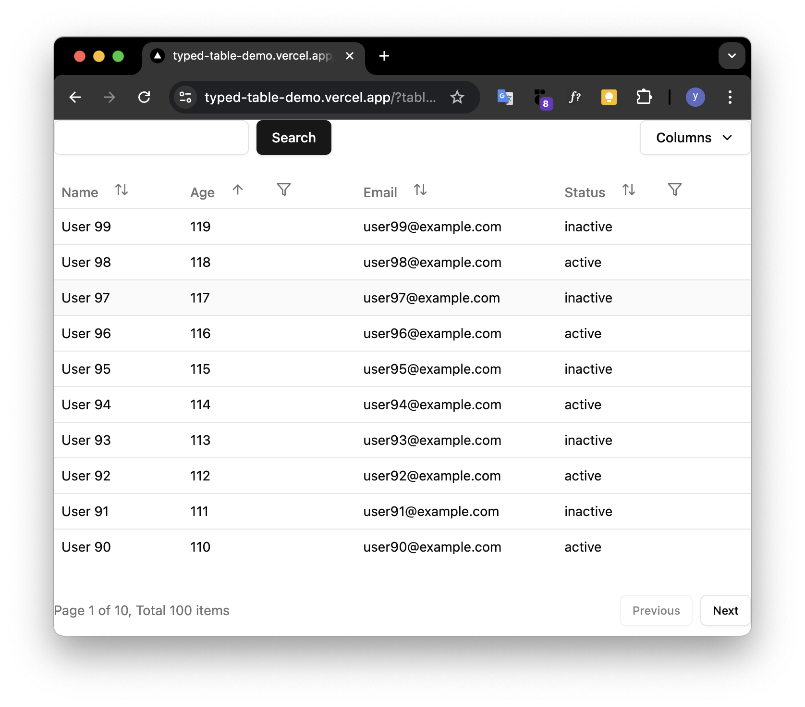
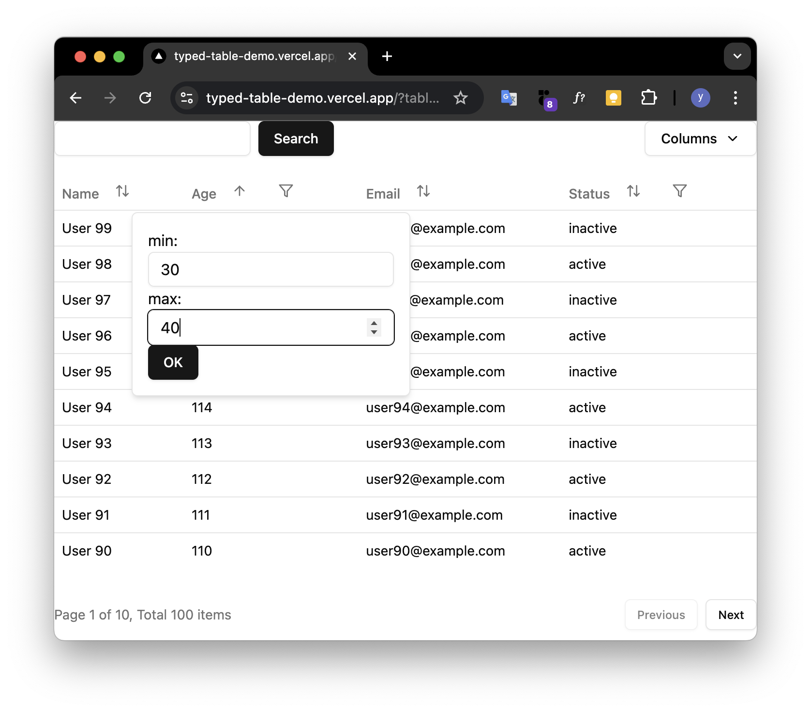

# タイプレベルリファクタリング奮闘記
## 〜この「型パズル」は読めません！〜

ygkn / Yugo Yagita

2025/05/23 [TSKaigi 2025](https://2025.tskaigi.org/)


---

# 自己紹介


- Yugo Yagita (ygkn)
- 株式会社ゆめみ フロントエンドエンジニア
- TypeScriptとReactを書いています
- アクセシビリティやっています
  - [ゆめみのアクセシビリティ](https://note.yumemi.co.jp/m/m625fa4a0c25e)
- [Storybookを開くVS Code拡張機能](https://github.com/ygkn/storybook-opener)とか作ってます
- 𝕏 [@ygkn35034](https://x.com/ygkn35034)

---

```typescript
type NonEmptyArray<T> = [T, ...T[]];

/**
 * テーブルに表示するデータ
 *
 * APIから取得したデータは、この型に変換してテーブルに表示する
 */
export type AnyTableViewModelBase = Record<string, unknown>;

/**
 * ページネーションの設定
 *
 * null の場合はページネーションを表示しない（指定忘れ防止のため、optional ではない）
 */
export type TablePaginationDefinition = null | {
  /**
   * 1ページあたりの表示数
   */
  parPage: number;
};

/**
 * キーワード検索の設定
 *
 * null の場合はキーワード検索を表示しない（指定忘れ防止のため、optional ではない）
 */
export type TableKeywordSearchDefinition = null | {
  renderSearchInput: (props: {
    value: string;
    onChange: (value: string) => void;
  }) => ReactNode;

  encode: (value: string) => string;
  decode: (value: string) => string | null;
};

export type NonNullColumnFilterDefinition<
  TableViewModelBaseType extends AnyTableViewModelBase,
  // eslint-disable-next-line @typescript-eslint/no-explicit-any
  FilterCondition = any
> = {
  renderPopupContent: (props: {
    rows: TableViewModelBaseType[];
    filter: FilterCondition | null;
    setFilter: (filter: FilterCondition | null) => void;
    isOpen: boolean;
    onClose: () => void;
  }) => ReactNode;
  renderFilterChipContent: (props: { filter: FilterCondition }) => ReactNode;
  encode: (filter: FilterCondition | null) => unknown;
  decode: (filter: unknown) => FilterCondition | null;
  initial: FilterCondition | null;
};

/**
 * 列のフィルターの設定
 *
 * null の場合はフィルターを表示しない（指定忘れ防止のため、optional ではない）
 */
export type ColumnFilterDefinition<
  TableViewModelBaseType extends AnyTableViewModelBase,
  // eslint-disable-next-line @typescript-eslint/no-explicit-any
  FilterCondition = any
> = null | NonNullColumnFilterDefinition<
  TableViewModelBaseType,
  FilterCondition
>;

/**
 * 列の表示/非表示の設定
 */
export type ColumnVisibilityDefinition = {
  initialVisibility: boolean;
};

/**
 * 列の定義
 */
export type ColumnDefinition<
  TableViewModelType extends AnyTableViewModelBase,
  K extends keyof TableViewModelType = keyof TableViewModelType,
  TColumnFilterDefinition extends ColumnFilterDefinition<TableViewModelType> = ColumnFilterDefinition<TableViewModelType>,
  TColumnSortDefinition extends boolean = boolean
> = {
  key: K;

  filter: TColumnFilterDefinition;

  sortable: TColumnSortDefinition;

  visibility: ColumnVisibilityDefinition;

  renderHeadCell: () => string;

  renderBodyCell: (props: {
    rowIndex: number;
    row: TableViewModelType;
    data: TableViewModelType[];
  }) => ReactNode;
};

export type TableDefinition<
  TableViewModelBaseType extends AnyTableViewModelBase,
  TablePaginationDefinitionType extends TablePaginationDefinition = TablePaginationDefinition,
  TableKeywordSearchDefinitionType extends TableKeywordSearchDefinition = TableKeywordSearchDefinition,
  ColumnDefinitions extends Array<
    ColumnDefinition<TableViewModelBaseType>
  > = Array<ColumnDefinition<TableViewModelBaseType>>
> = {
  /**
   * テーブルのキー
   *
   * localStorage に保存する際のキーとして使用する
   */
  key: string;

  pagination: TablePaginationDefinitionType;

  keywordSearch: TableKeywordSearchDefinitionType;

  columns: ColumnDefinitions;
};

/**
 * テーブルのキーワード検索の状態
 */
export type TableKeywordSearchState<
  TableViewModelBaseType extends AnyTableViewModelBase,
  TableDefinitionType extends TableDefinition<TableViewModelBaseType>
> =
  // TableDefinition から TableKeywordSearchDefinition を取り出す
  TableDefinitionType extends TableDefinition<
    TableViewModelBaseType,
    TablePaginationDefinition,
    infer TableKeywordSearchDefinitionInfer extends TableKeywordSearchDefinition
  >
    ? TableKeywordSearchDefinitionInfer extends null
      ? undefined
      : string
    : never;

type AnyTableSortState<
  SortBy extends string = string,
  SortOrder extends "asc" | "desc" = "asc" | "desc"
> = {
  sortBy: SortBy;
  sortOrder: SortOrder;
};

/**
 * テーブルのソートの状態
 *
 * デフォルトのソート順のときは undefined とする
 */
export type TableSortState<
  TableViewModelBaseType extends AnyTableViewModelBase,
  TableDefinitionType extends TableDefinition<TableViewModelBaseType>
> =
  // TableDefinition から ColumnDefinitions を取り出す
  TableDefinitionType extends TableDefinition<
    TableViewModelBaseType,
    TablePaginationDefinition,
    TableKeywordSearchDefinition,
    infer ColumnDefinitionsInfer
  >
    ? ColumnsSortKey<
        TableViewModelBaseType,
        ColumnDefinitionsInfer
      > extends string
      ?
          | AnyTableSortState<
              ColumnsSortKey<TableViewModelBaseType, ColumnDefinitionsInfer>
            >
          | undefined
      : undefined
    : never;

type TableSortKey<
  TableViewModelBaseType extends AnyTableViewModelBase,
  TableDefinitionType extends TableDefinition<TableViewModelBaseType>
> = TableDefinitionType extends TableDefinition<
  TableViewModelBaseType,
  TablePaginationDefinition,
  TableKeywordSearchDefinition,
  infer ColumnDefinitions
>
  ? ColumnsSortKey<TableViewModelBaseType, ColumnDefinitions>
  : never;

type ColumnsSortKey<
  TableViewModelBaseType extends AnyTableViewModelBase,
  ColumnDefinitions extends Array<ColumnDefinition<TableViewModelBaseType>>
> =
  // ColumnDefinitions に対して、再帰的に ColumnSortState を適用する
  // イメージ：
  // ColumnsSortState<..., [ColumnDefinition<...>, ColumnDefinition<...>]> =
  //   ColumnSortState<...> | ColumnsSortState<..., [ColumnDefinition<...>]> =
  //   ColumnSortState<...> | ColumnSortState<...> | ColumnsSortState<..., []> =
  //   ColumnSortState<...> | ColumnSortState<...> | never (union の単位元) =
  //   ColumnSortState<...> | ColumnSortState<...>
  //
  // ColumnDefinitions がタプルでない配列ならば、never を返す
  number extends ColumnDefinitions["length"]
    ? never
    : ColumnDefinitions extends [
        // 先頭の ColumnDefinition を取り出す
        ColumnDefinition<
          TableViewModelBaseType,
          infer Key,
          ColumnFilterDefinition<TableViewModelBaseType>,
          infer ColumnSortDefinitionType
        >,
        // 残りの ColumnDefinition の配列を取り出す。
        ...infer RestColumnDefinitions
      ]
    ?
        | ColumnSortState<TableViewModelBaseType, Key, ColumnSortDefinitionType>
        // 残りの ColumnDefinitions が空でないならば（停止条件）
        | (RestColumnDefinitions extends NonEmptyArray<
            ColumnDefinition<TableViewModelBaseType>
          >
            ? // 再帰的に ColumnsSortState を適用する
              ColumnsSortKey<TableViewModelBaseType, RestColumnDefinitions>
            : never)
    : never;

type ColumnSortState<
  TableViewModelBaseType extends AnyTableViewModelBase,
  Key extends keyof TableViewModelBaseType = keyof TableViewModelBaseType,
  ColumnSortableDefinitionType extends boolean = boolean
> = ColumnSortableDefinitionType extends true ? Key : never;

type TableColumnVisibilityState<
  TableViewModelBaseType extends AnyTableViewModelBase
> = Array<keyof TableViewModelBaseType>;

type TablePaginationState<
  TableViewModelBaseType extends AnyTableViewModelBase,
  TableDefinitionType extends TableDefinition<TableViewModelBaseType>
> =
  // TableDefinition から TablePaginationDefinition を取り出す
  TableDefinitionType extends TableDefinition<
    TableViewModelBaseType,
    infer TablePaginationDefinitionInfer
  >
    ? TablePaginationDefinitionInfer extends null
      ? undefined
      : number
    : never;

type TableFilterColumnState<
  TableViewModelBaseType extends AnyTableViewModelBase,
  TableDefinitionType extends TableDefinition<TableViewModelBaseType>
> =
  // TableDefinition から ColumnDefinitions を取り出す
  TableDefinitionType extends TableDefinition<
    TableViewModelBaseType,
    TablePaginationDefinition,
    TableKeywordSearchDefinition,
    infer ColumnDefinitions
  >
    ? ColumnsFilterState<TableViewModelBaseType, ColumnDefinitions>
    : never;

type ColumnsFilterState<
  TableViewModelBaseType extends AnyTableViewModelBase,
  ColumnDefinitions extends Array<ColumnDefinition<TableViewModelBaseType>>
> =
  // ColumnDefinitions から ColumnFilterState を組み立てる
  //
  // イメージ：
  // ColumnsFilterState<..., [ColumnDefinition<...>, ColumnDefinition<...>]> =
  //   ColumnFilterState<...> & ColumnsFilterState<..., [ColumnDefinition<...>]> =
  //   ColumnFilterState<...> & ColumnFilterState<...> & ColumnsFilterState<..., []> =
  //   ColumnFilterState<...> & ColumnFilterState<...> & {} (intersection の単位元) =
  //   ColumnFilterState<...> & ColumnFilterState<...>
  //
  // ColumnDefinitions がタプルでない配列ならば、never を返す
  number extends ColumnDefinitions["length"]
    ? never
    : // ColumnDefinitions から ColumnFilterState を組み立てる
    ColumnDefinitions extends [
        ColumnDefinition<
          TableViewModelBaseType,
          infer Key,
          infer ColumnFilterDefinitionType
        >,
        ...infer RestColumnDefinitions
      ]
    ? ColumnFilterState<
        TableViewModelBaseType,
        Key,
        ColumnFilterDefinitionType
      > & //
        // 残りの ColumnDefinitions が空（停止条件）でないならば
        (RestColumnDefinitions extends NonEmptyArray<
          ColumnDefinition<TableViewModelBaseType>
        >
          ? ColumnsFilterState<TableViewModelBaseType, RestColumnDefinitions>
          : Record<never, never>)
    : never;

type ColumnFilterState<
  TableViewModelBaseType extends AnyTableViewModelBase,
  Key extends keyof TableViewModelBaseType,
  ColumnFilterDefinitionType extends ColumnFilterDefinition<TableViewModelBaseType>
> = ColumnFilterDefinitionType extends null
  ? Record<never, never>
  : ColumnFilterDefinitionType extends ColumnFilterDefinition<
      TableViewModelBaseType,
      infer FilterConditionInfer
    >
  ? {
      [key in Key]: FilterConditionInfer | null;
    }
  : never;

type TableColumnFilterCondition<
  TableViewModelBaseType extends AnyTableViewModelBase,
  TableDefinitionType extends TableDefinition<TableViewModelBaseType>,
  ColumnKey extends keyof TableViewModelBaseType
> =
  // TableDefinition から ColumnDefinitions を取り出す
  TableDefinitionType extends TableDefinition<
    TableViewModelBaseType,
    TablePaginationDefinition,
    TableKeywordSearchDefinition,
    infer ColumnDefinitions
  >
    ? ColumnDefinitions[number] &
        ColumnDefinition<
          TableViewModelBaseType,
          ColumnKey
        > extends ColumnDefinition<
        TableViewModelBaseType,
        ColumnKey,
        ColumnFilterDefinition<
          TableViewModelBaseType,
          infer FilterConditionInfer
        >
      >
      ? FilterConditionInfer
      : never
    : never;

export type TableState<
  TableViewModelBaseType extends AnyTableViewModelBase,
  TableDefinitionType extends TableDefinition<TableViewModelBaseType>
> = {
  keywordSearch: TableKeywordSearchState<
    TableViewModelBaseType,
    TableDefinitionType
  >;
  sort: TableSortState<TableViewModelBaseType, TableDefinitionType>;
  columnVisibility: TableColumnVisibilityState<TableViewModelBaseType>;
  pagination: TablePaginationState<TableViewModelBaseType, TableDefinitionType>;

  filter: TableFilterColumnState<TableViewModelBaseType, TableDefinitionType>;
};

```

---

```ts
type ColumnsSortKey<
  TableViewModelBaseType extends AnyTableViewModelBase,
  ColumnDefinitions extends Array<ColumnDefinition<TableViewModelBaseType>>
> =
  // ColumnDefinitions に対して、再帰的に ColumnSortState を適用する
  number extends ColumnDefinitions["length"]
    ? never
    : ColumnDefinitions extends [
        // 先頭の ColumnDefinition を取り出す
        ColumnDefinition<
          TableViewModelBaseType,
          infer Key,
          ColumnFilterDefinition<TableViewModelBaseType>,
          infer ColumnSortDefinitionType
        >,
        // 残りの ColumnDefinition の配列を取り出す。
        ...infer RestColumnDefinitions
      ]
    ?
        | ColumnSortState<TableViewModelBaseType, Key, ColumnSortDefinitionType>
        // 残りの ColumnDefinitions が空（停止条件）でないならば
        | (RestColumnDefinitions extends NonEmptyArray<
            ColumnDefinition<TableViewModelBaseType>
          >
            ? // 再帰的に ColumnsSortState を適用する
              ColumnsSortKey<TableViewModelBaseType, RestColumnDefinitions>
            : never)
    : never;
```

---

興味がある人は↓をご覧ください

https://github.com/ygkn/typed-table-demo/blob/9cf8e2ddfc63a2f32a13a2b00a43a02ac80be0f5/src/features/table/createTable.tsx#L27-L385

---

# どうしてこうなった？

---


# 型安全なテーブルを作りたかった

---




---




---


---


---

デモ： https://typed-table-demo.vercel.app/
GitHub：https://github.com/ygkn/typed-table-demo/

（注：型が主役のため、実装は雑になっているところがあります）

---


```typescript
const { table, columnFilter } = createTable<UserViewModel>();

const usersTable = table({
  key: "users",
  pagination: { perPage: 10 },
  keywordSearch: { /* キーワード検索の設定 */},
  columns: [
    {
      key: "name",
      filter: null,
      sortable: true,
      visibility: { initialVisibility: true },
      renderHeadCell: () => "名前",
      renderBodyCell: ({ row }) => row.name
    },
    {
      key: "age",
      filter: columnFilter<AgeFilter>({
        renderPopupContent: ({ filter, setFilter }) => (/* ... */),
        // ...フィルター設定
      }),
      // ...他の設定
    }
  ]
});

```

---

```ts

actions.setFilter("age", { min: 20, max: null }); // OK
actions.setFilter("status", "active"); // OK

// 型エラーが検出される！
actions.setFilter("nonExistent", { min: 20 }); // NG
actions.setFilter("status", true); // NG
```


---

# しかし


---


# チームメンバー「この型は読めないですね...」

# 自分「確かに…🦀」

---


# 型を読めてメンテナンスできるようにしよう！


---

# 型レベルリファクタリング Tips

1. 型のテストを書いて安全に修正できるようにする
1. 必要以上の型安全性を追求せず保守性を優先
1. AIを使った型リファクタリング

---

# 型のテストの導入


```ts
// `useTable().state` の型 をチェック
expectTypeOf(table.useTable).returns.toHaveProperty("state").toEqualTypeOf<{
  keywordSearch: string | null;
  sort: {
    // sortByはソート可能なカラムのみ
    sortBy: "name" | "age" | null;
    sortOrder: "asc" | "desc" | null;
  };
  // ...
}>();
```

Vitestの型テスト（<https://vitest.dev/guide/testing-types>）で型推論の結果をチェック

後述するAIによるリファクタリング時でもガードレールとして助かった


---

# 必要以上の型安全性は追求しない

---

ページネーションあり：
```typescript
const { useTable, Table } = createTable({
  pagination: { perPage: 10 }
})

state.pagination // -> 1

<Table />
```

ページネーションなし：
```typescript
const { useTable, Table } = createTable({
  pagination: null
})


state.pagination // -> 1

<Table />
```

---

ページネーションあり：
```tsx
const { useTable } = createTable({
  // ページネーションの設定はない
})

state.pagination // -> 1

<Table>...</Table>
<Pagination {...}> // コンポジションで実装
```

ページネーションなし：
```tsx
const { useTable } = createTable({
  // ページネーションの設定はない
})

state.pagination // -> 1

<Table>...</Table>
```


---

# 必要以上の「型安全性」は追求しない

ページネーションがUIとして出ていなくても初期値（ページ数: `1`）が出てしまうが…
メンテナンス性のために妥協

（バックエンドにはページネーション付きでリクエストしてしまい、2ページ以降のデータにアクセスできなくなる恐れはある）

---

# AIの力を借りる

---


```typescript

type ColumnsSortKey<
  TableViewModelBaseType extends TableViewModelBase,
  ColumnDefinitions extends Array<ColumnDefinition<TableViewModelBaseType>>,
> =
  // ColumnDefinitions に対して、再帰的に ColumnSortState を適用する
  // イメージ：
  // ColumnsSortState<..., [ColumnDefinition<...>, ColumnDefinition<...>]> =
  //   ColumnSortState<...> | ColumnsSortState<..., [ColumnDefinition<...>]> =
  //   ColumnSortState<...> | ColumnSortState<...> | ColumnsSortState<..., []> =
  //   ColumnSortState<...> | ColumnSortState<...> | never (union の単位元) =
  //   ColumnSortState<...> | ColumnSortState<...>
  //
  // ColumnDefinitions がタプルでない配列ならば、never を返す
  number extends ColumnDefinitions['length']
    ? never
    : ColumnDefinitions extends [
          // 先頭の ColumnDefinition を取り出す
          ColumnDefinition<
            TableViewModelBaseType,
            infer Key,
            ColumnFilterDefinition<TableViewModelBaseType>,
            infer ColumnSortDefinitionType
          >,
          // 残りの ColumnDefinition の配列を取り出す。
          ...infer RestColumnDefinitions,
        ]
      ?
          | (ColumnSortDefinitionType extends true ? Key : never)
          // 残りの ColumnDefinitions が空でないならば（停止条件）
          | (RestColumnDefinitions extends NonEmptyArray<
              ColumnDefinition<TableViewModelBaseType>
            >
              ? // 再帰的に ColumnsSortState を適用する
                ColumnsSortKey<TableViewModelBaseType, RestColumnDefinitions>
              : never)
      : never;
```

---

# 「この型をリファクタリングして」と言うと…


```typescript
type ColumnsSortKey<T extends ColumnDefinition[]> = {
  [K in keyof T]: T[K] extends ColumnDefinition<
    infer Key,
    ColumnFilterDefinition,
    true
  >
    ? Key
    : never;
}[number];
```

再帰の代わりにMapped Typesを使い、23行→9行に

考察： 複雑な型が出てくるOSSを学習しているから型レベルプログラミングが得意？

（ただし、プロンプトを気をつけないと `any` や `@ts-ignore` を使われることも）

---

# 検索しにくい型も「これ何？」で教えてくれる


---

# リファクタリングの結果


## 型定義がシンプルに！

- 行数：300行以上→150行に
- Conditional Types： 19個→8個に
- `infer`: 14個→3個に
- 再帰: 2個→0個に

もちろん、型安全性は保てたまま！


---

# おわりに：「型パズル」は悪なのか？

- 高度な型の操作を「できない」と「あえてしない」は違う
- 複雑な型を回避できる場面と手法を理解するために、「型パズル」を知る
- 今回紹介したテクニックがあなたの型ライフに役立つことを祈っています 🙏
